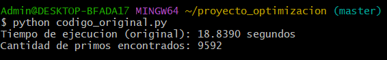
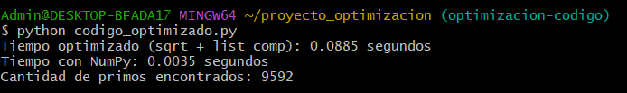
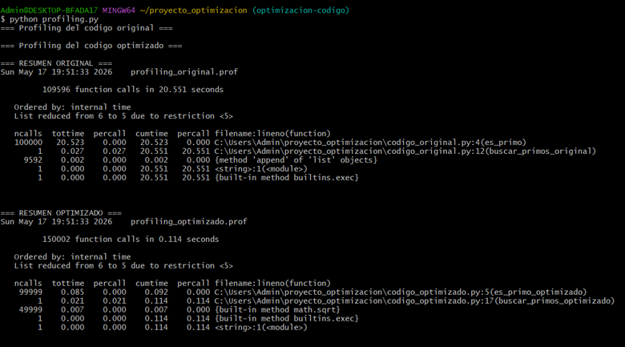
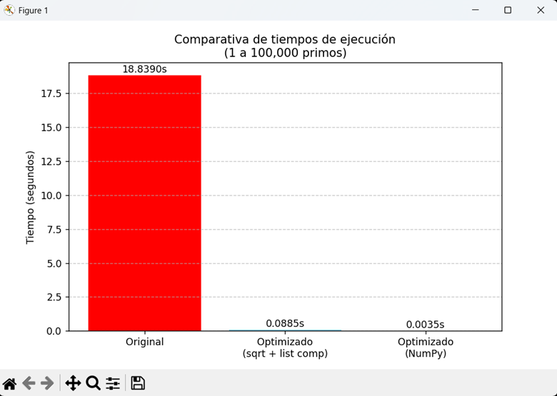
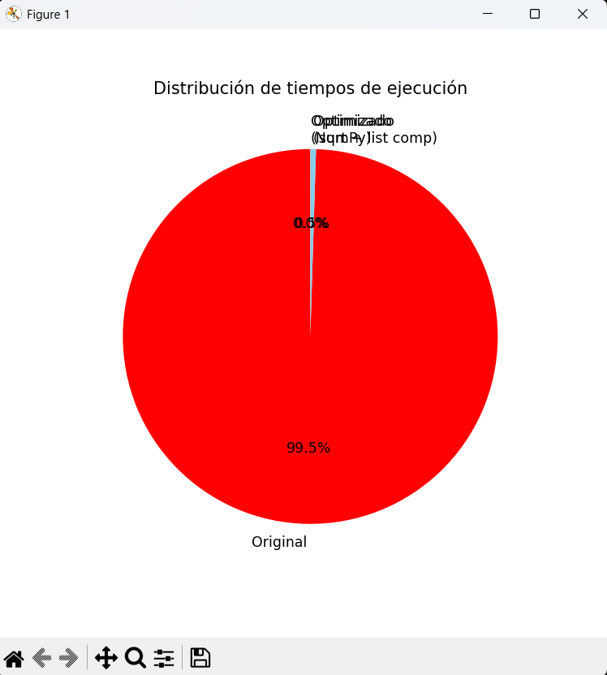

# Documentación del Proyecto: Optimización de Código para Cálculo de Primos

**Autor:** Klever Alexis Castillo
**Fecha:** 17-05-2026
**Carrera:** Ciencia de Datos
**Semestre:** Tercero 'B'
**Periodo académico:** 2026-1S

---

## Introducción

El código original implementa un algoritmo de búsqueda de números primos entre 1 y 100,000 usando un bucle anidado (O(n²)), lo que resulta en un tiempo de ejecución elevado (~18.84 segundos). Se identificaron como problemas principales:

- Iteración completa hasta n en la función `es_primo`
- Uso de bucles tradicionales en lugar de comprensiones de listas
- No aprovechamiento de operaciones vectorizadas

---

## Técnicas de optimización aplicadas

1. **Reducción del rango de búsqueda**: Se itera solo hasta la raíz cuadrada de n
2. **Exclusión de pares**: Se saltan números pares después del 2
3. **List comprehensions**: Reemplazan bucles for tradicionales
4. **Uso de NumPy**: Vectorización de operaciones con arrays

---

##  Resultados obtenidos
=======
## Resultados comparativos 

## 📊 Resultados obtenidos

### Tiempos de ejecución

| Versión | Tiempo (segundos) | Mejora vs Original |
|---------|-------------------|---------------------|
| Original | 18.8390 | - |
| Optimizado (sqrt + list comp) | 0.0885 | 213x más rápido |
| Optimizado con NumPy | 0.0035 | 5,382x más rápido |

### Capturas de pantalla
=======
### Capturas de pantalla de la ejecución

#### Código original

#### Código optimizado

### Profiling con cProfile

**Análisis del profiling:**
- **Original:** 100,000 llamadas a `es_primo` consumen 20.523 segundos (99.9% del tiempo)
- **Optimizado:** 99,999 llamadas a `es_primo_optimizado` consumen solo 0.085 segundos

### Gráficos comparativos

#### Comparativa de tiempos (barras)

#### Distribución de tiempos (pastel)

---

## Conclusiones

- La optimización del rango de búsqueda produce la mayor ganancia (pasa de O(n) a O(√n))
- NumPy mejora aún más el rendimiento gracias a operaciones en C
- Se recomienda siempre perfilar el código antes y después de optimizar
- Buenas prácticas como PEP 8 y modularización facilitan el mantenimiento

---

##  Enlace al repositorio GitHub

[https://github.com/Klever-20/proyecto_optimizacion](https://github.com/Klever-20/proyecto_optimizacion)

---

=======

##  Datos del estudiante

- **Nombre:** Klever Alexis Castillo
- **Fecha:** 17-05-2026
- **Carrera:** Ciencia de Datos
- **Semestre:** Tercero 'B'
- **Periodo académico:** 2026-1S

---

## Enlace al repositorio GitHub
https://github.com/Klever-20/proyecto_optimizacion

