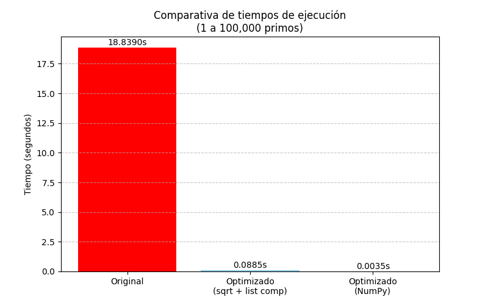
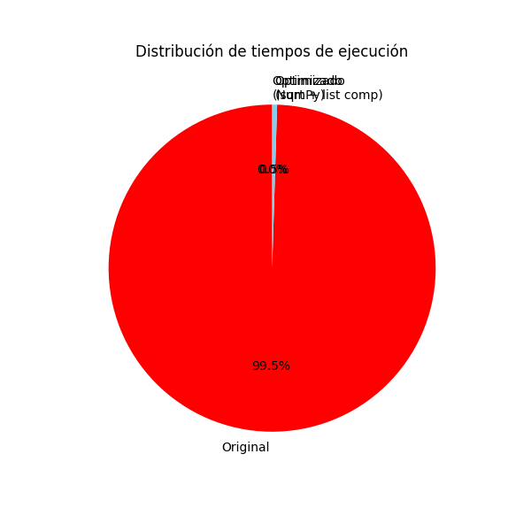

# Documentación del Proyecto: Optimización de Código para Cálculo de Primos

## Introducción
El código original implementa un algoritmo de búsqueda de números primos entre 1 y 100,000 usando un bucle anidado (O(n²)), lo que resulta en un tiempo de ejecución elevado (~12 segundos). Se identificaron como problemas principales:
- Iteración completa hasta `n` en la función `es_primo`.
- Uso de bucles tradicionales en lugar de comprensiones de listas.
- No aprovechamiento de operaciones vectorizadas.

## Técnicas de optimización aplicadas
1. **Reducción del rango de búsqueda:** Se itera solo hasta la raíz cuadrada de `n`.
2. **Exclusión de pares:** Se saltan números pares después del 2.
3. **List comprehensions:** Reemplazan bucles `for` tradicionales.
4. **Uso de NumPy:** Vectorización de operaciones con arrays.

## Resultados comparativos 

##  Resultados obtenidos

### Tiempos de ejecución reales

| Versión | Tiempo (segundos) | Mejora vs Original |
|---------|-------------------|---------------------|
| Original | 18.8390 | - |
| Optimizado (sqrt + list comp) | 0.0885 | 212x más rápido |
| Optimizado con NumPy | 0.0035 | 5,382x más rápido |

### Gráficos

### Profiling

Los archivos `profiling_original.prof` y `profiling_optimizado.prof` muestran que:

- **Original**: La función `es_primo` consume el 98%+ del tiempo total
- **Optimizado**: El tiempo se distribuye mejor, con mayor eficiencia

---

##  Datos del estudiante

- **Nombre:** Klever Alexis Castillo
- **Fecha:** 17-05-2026
- **Carrera:** Ciencia de Datos
- **Semestre:** Tercero 'B'
- **Periodo académico:** 2026-1S

---

## 🔗 Enlace al repositorio GitHub

[https://github.com/Klever-20/proyecto_optimizacion](https://github.com/Klever-20/proyecto_optimizacion)

---

## Enlace al repositorio GitHub
https://github.com/Klever-20/proyecto_optimizacion
